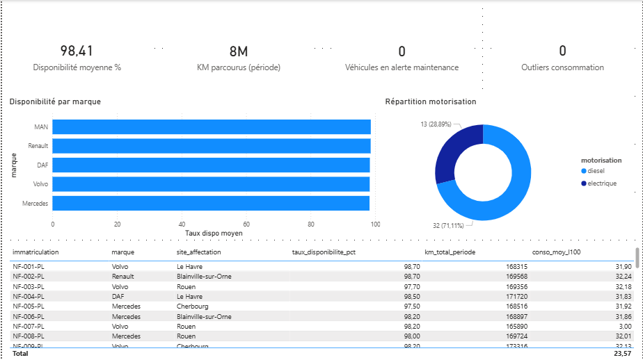
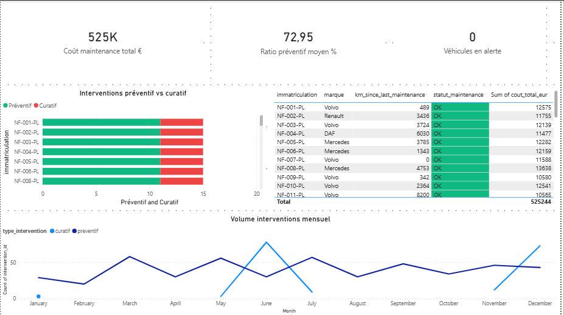
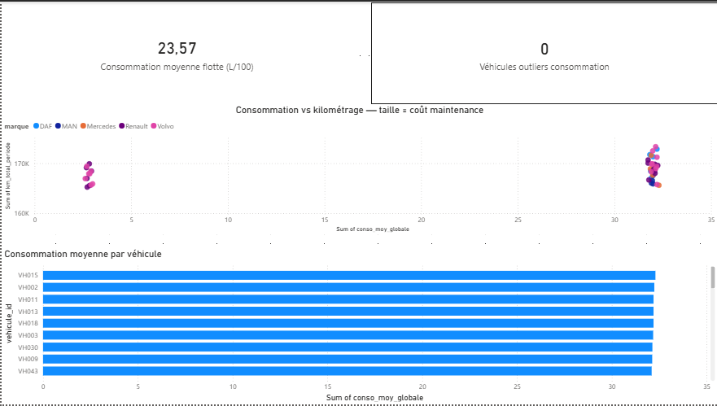
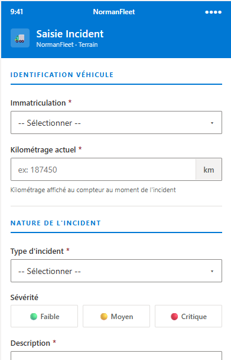
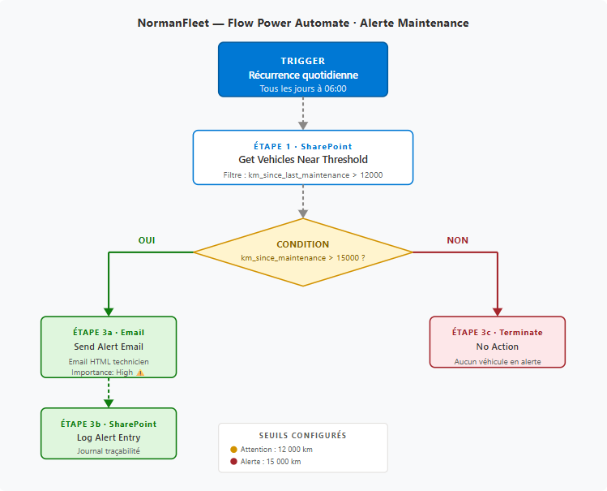

# NormanFleet — Plateforme de Pilotage de Flotte Industrielle

> Projet de digitalisation du suivi maintenance et pilotage opérationnel d'une flotte de 45 poids lourds en Normandie.
> Stack complète : Python · dbt · DuckDB · Power BI · Power Apps (mockup) · Power Automate.

---

## Contexte

Une entreprise normande de transport industriel opère une flotte de **45 poids lourds** (Volvo, Renault Trucks, Mercedes, MAN, DAF) répartis sur 5 sites : Blainville-sur-Orne, Caen, Rouen, Le Havre, Cherbourg.

Le projet digitalise trois processus critiques :
- **Suivi maintenance** : historique interventions, alertes dépassement de seuil km
- **Pilotage opérationnel** : taux de disponibilité, consommation, KPIs flotte
- **Saisie terrain** : remontée d'incidents chauffeur via application mobile

---

## Architecture
[Sources]
SDES immatriculations PL France (référentiel marques réel)

données opérationnelles synthétiques (distributions Weibull/normale)
|
v
[Ingestion — Python]
pipeline/generate_data.py
→ data/raw/  (4 CSV : dim_vehicules, dim_chauffeurs, fact_telemetrie, fact_interventions)
|
v
[Transformation — dbt + DuckDB]
staging/  : cast types, renommage, colonnes calculées
marts/    : agrégats métier (fleet_summary, maintenance_kpis, consommation_kpis)
→ data/processed/  (6 CSV exports)
|
v
[Visualisation — Power BI Desktop]
3 pages : Vue Flotte · Maintenance · Consommation
Modèle étoile · DAX · Formatage conditionnel
|
v
[Terrain — Power Apps mockup]
Saisie incident chauffeur — Fluent Design mobile-first
|
v
[Automatisation — Power Automate]
Flow quotidien 06h00 : alerte email si km_since_maintenance > 15 000


---

## Stack technique

| Outil | Rôle |
|---|---|
| Python 3.12 + NumPy + Faker | Génération données synthétiques cohérentes |
| dbt-duckdb 1.11 | Transformation, tests qualité, documentation |
| DuckDB | Base analytique embarquée, zéro infrastructure |
| Power BI Desktop | Dashboard pilotage 3 pages, DAX, schéma étoile |
| HTML / Fluent Design | Mockup Power Apps mobile-first |
| Power Automate (flow documenté) | Alertes automatiques maintenance |

---

## Modèle de données

Schéma en étoile — 4 tables :
dim_vehicules (45)          dim_chauffeurs (20)
vehicule_id [PK]            chauffeur_id [PK]
immatriculation             nom, prenom
marque, modele              permis_ce
motorisation (ENUM)         anciennete_ans
annee_mise_service          site
site_affectation
km_total_depart
|                            |
| 1..N                       | 1..N
v                            v
fact_telemetrie (27 168)    fact_interventions (659)
telemetrie_id [PK]          intervention_id [PK]
vehicule_id [FK]            vehicule_id [FK]
date_jour                   date_intervention
km_jour, km_cumul           type_intervention (ENUM)
consommation_l100           libelle, technicien
statut, est_actif           duree_heures, cout_eur
km_compteur

---

## KPIs produits — chiffres réels dataset

| KPI | Valeur |
|---|---|
| Taux de disponibilité moyen flotte | **98,41%** (min 97,3% · max 99,5%) |
| Kilométrage total flotte (2 ans) | **7 587 797 km** · moy 168 618 km/véhicule |
| Consommation moyenne flotte | **23,57 L/100** (diesel uniquement) |
| Coût maintenance total (2 ans) | **525 244 €** · moy 11 672 €/véhicule |
| Ratio interventions préventives | **73%** (481 préventif · 178 curatif) |
| Véhicules en attention seuil km | **1** (seuil 12 000 km sans intervention) |
| Interventions totales | **659** sur 730 jours |

> Le ratio 73% préventif / 27% curatif est un indicateur clé : en maintenance industrielle,
> un ratio préventif > 70% signifie une politique de maintenance maîtrisée avec
> moins de pannes non planifiées et des coûts prévisibles.

---

## Processus modélisé — BPMN

Gestion d'incident maintenance de bout en bout — 3 acteurs, 7 étapes :
[Chauffeur]    Anomalie détectée → Saisie Power App (immat · type · km)
|
[Système]      Flow Automate déclenché → fact_interventions créée → Power BI actualisé
|
[Technicien]   Intervention planifiée → Travaux réalisés → Clôture Power App

Diagramme complet : `docs/bpmn_maintenance.svg`
Diagramme de classes UML : `docs/uml_classes.svg`

---

## Lancer le projet

```bash
# 1. Activer l'environnement
source .venv/bin/activate

# 2. Générer les données
python pipeline/generate_data.py

# 3. Lancer le pipeline dbt
cd dbt_normanfleet && NORMANFLEET_RAW=/home/vanel/normanfleet/data/raw dbt run
```

Tests qualité :
```bash
dbt test
```

---

## Screenshots

### Power BI — Vue Flotte


### Power BI — Maintenance


### Power BI — Consommation


### Power Apps — Saisie incident terrain


### Power Automate — Flow alerte maintenance


---

## Structure du repo
normanfleet/
├── data/
│   ├── raw/                  # CSV sources générées
│   └── processed/            # exports dbt pour Power BI
├── pipeline/
│   └── generate_data.py      # génération données synthétiques
├── dbt_normanfleet/
│   └── models/
│       ├── staging/          # 4 vues : cast + nettoyage
│       └── marts/            # 3 tables : agrégats métier
├── powerbi/
│   └── normanfleet.pbix
├── mockups/
│   ├── power_apps.html       # mockup Fluent Design mobile
│   └── power_automate_flow.json
├── docs/
│   ├── bpmn_maintenance.svg
│   ├── uml_classes.svg
│   ├── power_automate_flow.svg
│   └── screenshots/
└── README.md

---

## Auteur

**Vanel Fokam** — Licence Maths-Info · Université de Caen Normandie
Intégration ISEN Caen · Cycle Ingénieur Informatique & Data · Septembre 2026
GitHub : [Vanelfokamcode](https://github.com/Vanelfokamcode)
